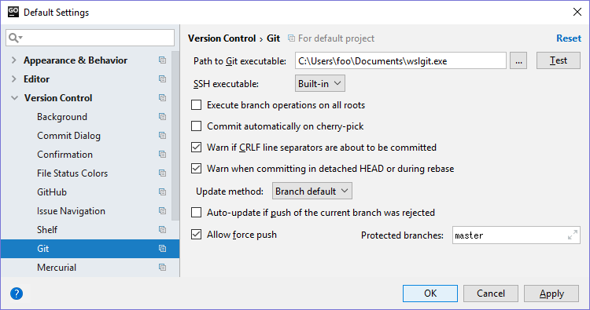

# wslexec [](https://circleci.com/gh/int128/wslexec)

A wrapper to run a Linux command inside WSL (Windows Subsystem for Linux) from Windows native applications.


## Getting Started

Download [the latest release](https://github.com/int128/wslexec/releases).

Rename the binary to command name with prefix `wsl`.
For example, rename the binary to `wslgit` to run the `git` command inside WSL.

### IntelliJ IDEA and GoLand

Open Default Settings - Version Control - Git and set the Path to Git executable.



### Visual Studio Code

Using Git on WSL:

```json
{
  "git.path": "C:\\Users\\foo\\Documents\\wslgit.exe"
}
```

Using PHP on WSL:

```json
{
  "php.validate.executablePath": "C:\\Users\\foo\\Documents\\wslphp.exe"
}
```


## How it works

### Windows path translation

Windows paths (e.g. `C:\`) in the command line are translated to WSL paths (e.g. `/mnt/c`).

For example,

```sh
wslgit.exe -C C:\Users\foo\example log
```

is translated to following:

```sh
git -C /mnt/c/Users/foo/example log
```

### WSL path translation

WSL paths (e.g. `/mnt/c`) in the standard input are translated to Windows paths (e.g. `C:/`).

For example,

```sh
/mnt/c/Users/foo/example
```

is translated to following:

```sh
c:/Users/foo/example
```


## Contributions

Feel free to open an issue or pull request.

### Release from CircleCI

Push a tag, then CircleCI will release a build to GitHub.

It requires following environment variable:

- `GITHUB_TOKEN`
